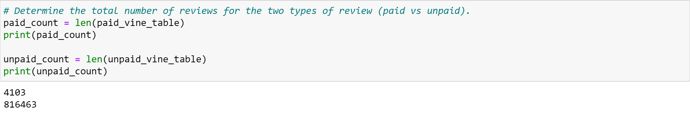
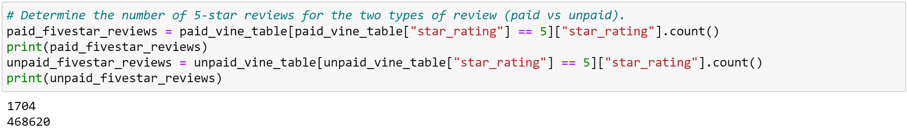
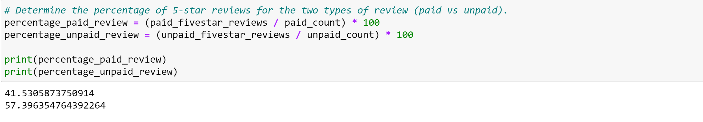

# Amazon Vine Analysis

## Overview:
The purpose of this analysis is to evaluate Amazon reviews written by members of the paid Amazon Vine Program. The Amazon Vine program is a service that allows manufacturers and publishers to receive reviews for their products. Companies pay a fee to Amazon and provide products to Amazon Vine members, who are then required to publish a review.

This analysis was preformed on pet products using PySpark to perform the ETL process to extract the dataset, transform the data, connect to an AWS RDS instance, and load the transformed data into pgAdmin. Pandas was used to then determine if there is any bias toward favorable reviews from Vine members in the dataset. 

## Results: 

* There were 4103 Vine reviews and 816463 non-Vine reviews. 

* There were 1704 5 star Vine reviews and 468620 5 star non-Vine reviews.

* 41.53% of the Vine reviews were 5 stars and 57.4% of the non-Vine reviews were 5 stars.

## Summary: 
There does not seem to be any positivity bias for reviews in the Vine program. Only 41.53% of Vine reviews were 5 stars, whereas 57.4% of non-Vine reviews were 5 stars. If anything, it seems paid reviews were harsher on the products than non-paid reviews. To further complete this analysis, the same evaluation done with 5 star reviews should be done with 1-4 star reviews. Furthermore, a statistical analysis should be completed to assess whether or not the differences in ratings between Vine and non-Vine reviews are statistically significant. 